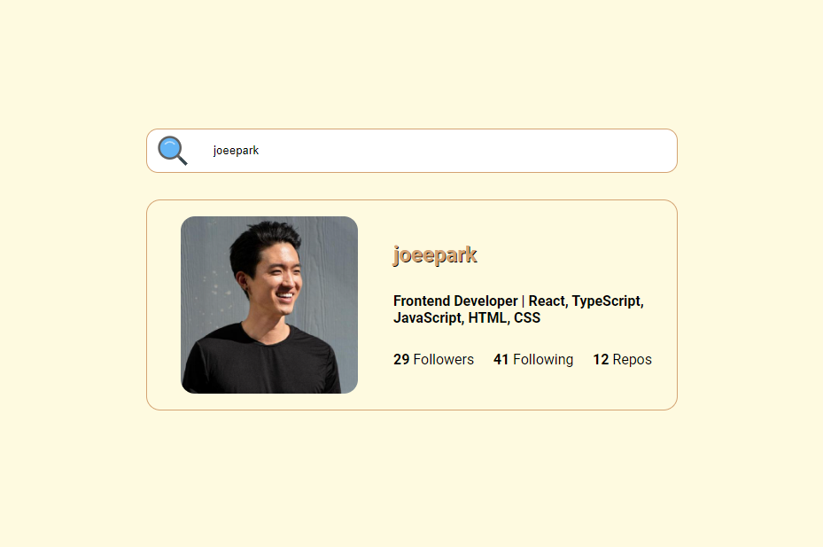
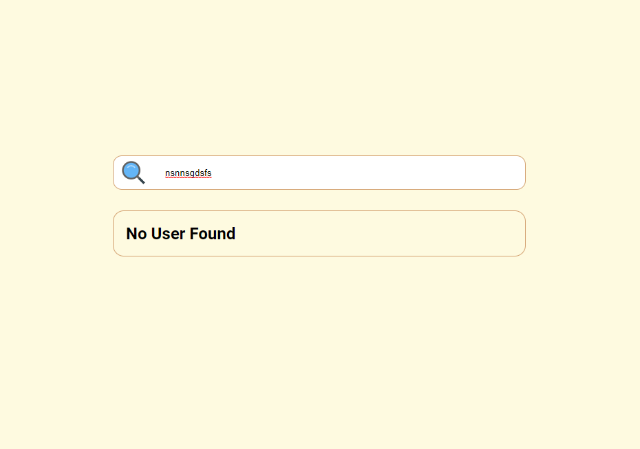

## Here is an accumulation of micro projects for me to master React/JavaScript/TypeScript.
The goal here is to focus on creating features/projects with React to implement responsive features and good-looking designs that are production ready.

## Github Profile Cards
- Created a search bar that displays a Github user's profile information
- Added event listeners to listen to a user's input and used Axios to fetch the data using Github's user API to display the correct info
- Used media thresholds to make the info mobile friendly
 

